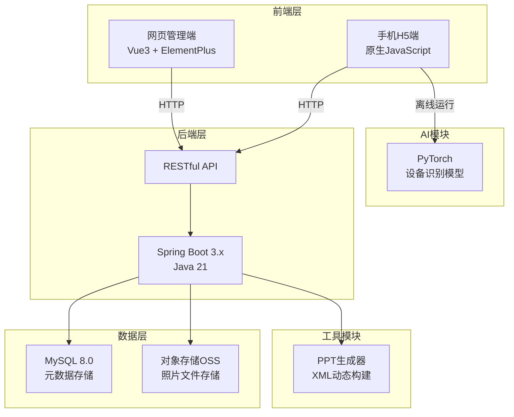
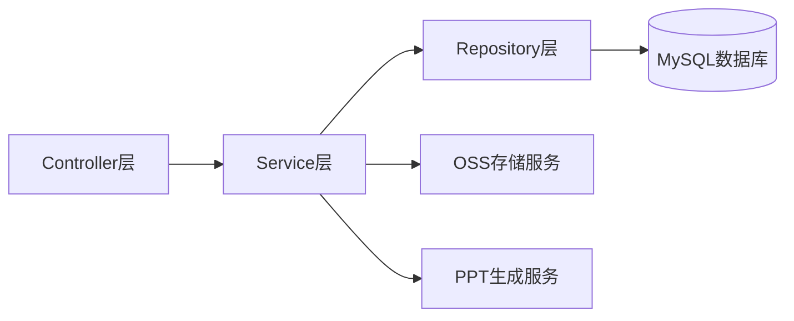
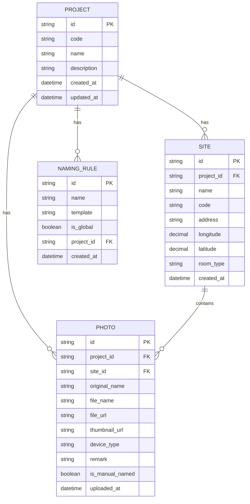

## 1. Architecture Design
通信勘察照片智能整理系统采用前后端分离架构，包含网页管理端、手机H5端和Java后端服务三个主要部分。



## 2. Technology Description
- 网页管理端：Vue3 + TypeScript + ElementPlus + Vite + Tailwind CSS
- 手机H5端：原生JavaScript + IndexedDB + WebRTC
- 后端：Spring Boot 3.x + Java 21 + MyBatis Plus
- 数据库：MySQL 8.0
- 对象存储：兼容OSS协议的对象存储服务
- AI识别：PyTorch + ONNX Runtime（前端离线运行）
- PPT生成：POI（纯Java实现）

## 3. Route Definitions

### 网页管理端路由
| Route | Purpose |
|-------|---------|
| / | 项目列表首页 |
| /projects/new | 新建项目 |
| /projects/:id | 项目详情 |
| /projects/:id/import | 勘察报告导入 |
| /projects/:id/sites | 站点管理 |
| /projects/:id/photos | 照片管理 |
| /settings/rules | 命名规则配置 |
| /projects/:id/ppt | PPT生成 |

### 后端API路由
| Route | Method | Purpose |
|-------|--------|---------|
| /api/projects | GET | 获取项目列表 |
| /api/projects | POST | 创建项目 |
| /api/projects/:id | GET | 获取项目详情 |
| /api/projects/:id/qrcode | GET | 获取项目二维码 |
| /api/projects/:id/import | POST | 导入勘察报告 |
| /api/sites | GET | 获取站点列表 |
| /api/sites | POST | 创建站点 |
| /api/photos | GET | 获取照片列表 |
| /api/photos | POST | 上传照片 |
| /api/photos/:id | PUT | 更新照片信息 |
| /api/photos/:id | DELETE | 删除照片 |
| /api/ppt/generate | POST | 生成PPT |

## 4. API Definitions

### TypeScript类型定义
```typescript
// 项目类型
interface Project {
  id: string;
  code: string;
  name: string;
  description?: string;
  createdAt: string;
  qrcodeUrl: string;
  siteCount: number;
  photoCount: number;
}

// 站点类型
interface Site {
  id: string;
  projectId: string;
  name: string;
  code: string;
  address?: string;
  longitude?: number;
  latitude?: number;
  roomType?: string;
}

// 照片类型
interface Photo {
  id: string;
  projectId: string;
  siteId: string;
  originalName: string;
  fileName: string;
  fileUrl: string;
  thumbnailUrl: string;
  deviceType?: string;
  remark?: string;
  isManualNamed: boolean;
  uploadedAt: string;
}

// 命名规则类型
interface NamingRule {
  id: string;
  name: string;
  template: string;
  isGlobal: boolean;
  projectId?: string;
}
```

### API请求/响应示例
```typescript
// 创建项目请求
POST /api/projects
{
  "code": "PROJ2024001",
  "name": "某地市5G基站勘察项目",
  "description": "2024年度5G基站建设勘察"
}

// 创建项目响应
{
  "code": 200,
  "message": "success",
  "data": {
    "id": "proj-001",
    "code": "PROJ2024001",
    "name": "某地市5G基站勘察项目",
    "qrcodeUrl": "https://example.com/qrcode/proj-001.png",
    "createdAt": "2024-01-01T00:00:00Z"
  }
}

// 上传照片请求
POST /api/photos
Content-Type: multipart/form-data
{
  "projectId": "proj-001",
  "siteId": "site-001",
  "file": File,
  "deviceType": "机柜",
  "remark": "主设备机柜正面"
}
```

## 5. Server Architecture Diagram



### 分层说明
- **Controller层**：处理HTTP请求，参数校验，响应封装
- **Service层**：业务逻辑处理，事务管理
- **Repository层**：数据访问，使用MyBatis Plus
- **外部服务**：OSS对象存储、PPT生成器

## 6. Data Model

### 6.1 Data Model Definition



### 6.2 Data Definition Language

```sql
-- 创建项目表
CREATE TABLE projects (
    id VARCHAR(64) PRIMARY KEY COMMENT '项目ID',
    code VARCHAR(64) NOT NULL UNIQUE COMMENT '项目编号',
    name VARCHAR(255) NOT NULL COMMENT '项目名称',
    description TEXT COMMENT '项目描述',
    created_at DATETIME NOT NULL DEFAULT CURRENT_TIMESTAMP COMMENT '创建时间',
    updated_at DATETIME NOT NULL DEFAULT CURRENT_TIMESTAMP ON UPDATE CURRENT_TIMESTAMP COMMENT '更新时间',
    INDEX idx_code (code),
    INDEX idx_created_at (created_at)
) ENGINE=InnoDB DEFAULT CHARSET=utf8mb4 COMMENT='项目表';

-- 创建站点表
CREATE TABLE sites (
    id VARCHAR(64) PRIMARY KEY COMMENT '站点ID',
    project_id VARCHAR(64) NOT NULL COMMENT '项目ID',
    name VARCHAR(255) NOT NULL COMMENT '站点名称',
    code VARCHAR(64) NOT NULL COMMENT '站点编号',
    address VARCHAR(500) COMMENT '地址',
    longitude DECIMAL(10, 6) COMMENT '经度',
    latitude DECIMAL(10, 6) COMMENT '纬度',
    room_type VARCHAR(100) COMMENT '机房类型',
    created_at DATETIME NOT NULL DEFAULT CURRENT_TIMESTAMP COMMENT '创建时间',
    FOREIGN KEY (project_id) REFERENCES projects(id) ON DELETE CASCADE,
    INDEX idx_project_id (project_id),
    INDEX idx_code (code)
) ENGINE=InnoDB DEFAULT CHARSET=utf8mb4 COMMENT='站点表';

-- 创建照片表
CREATE TABLE photos (
    id VARCHAR(64) PRIMARY KEY COMMENT '照片ID',
    project_id VARCHAR(64) NOT NULL COMMENT '项目ID',
    site_id VARCHAR(64) NOT NULL COMMENT '站点ID',
    original_name VARCHAR(255) NOT NULL COMMENT '原始文件名',
    file_name VARCHAR(255) NOT NULL COMMENT '规范文件名',
    file_url VARCHAR(500) NOT NULL COMMENT '文件URL',
    thumbnail_url VARCHAR(500) COMMENT '缩略图URL',
    device_type VARCHAR(100) COMMENT '设备类型',
    remark TEXT COMMENT '备注',
    is_manual_named BOOLEAN NOT NULL DEFAULT FALSE COMMENT '是否手动命名',
    uploaded_at DATETIME NOT NULL DEFAULT CURRENT_TIMESTAMP COMMENT '上传时间',
    FOREIGN KEY (project_id) REFERENCES projects(id) ON DELETE CASCADE,
    FOREIGN KEY (site_id) REFERENCES sites(id) ON DELETE CASCADE,
    INDEX idx_project_id (project_id),
    INDEX idx_site_id (site_id),
    INDEX idx_uploaded_at (uploaded_at)
) ENGINE=InnoDB DEFAULT CHARSET=utf8mb4 COMMENT='照片表';

-- 创建命名规则表
CREATE TABLE naming_rules (
    id VARCHAR(64) PRIMARY KEY COMMENT '规则ID',
    name VARCHAR(100) NOT NULL COMMENT '规则名称',
    template VARCHAR(500) NOT NULL COMMENT '命名模板',
    is_global BOOLEAN NOT NULL DEFAULT FALSE COMMENT '是否全局规则',
    project_id VARCHAR(64) COMMENT '项目ID',
    created_at DATETIME NOT NULL DEFAULT CURRENT_TIMESTAMP COMMENT '创建时间',
    FOREIGN KEY (project_id) REFERENCES projects(id) ON DELETE CASCADE,
    INDEX idx_is_global (is_global),
    INDEX idx_project_id (project_id)
) ENGINE=InnoDB DEFAULT CHARSET=utf8mb4 COMMENT='命名规则表';

-- 插入默认命名规则
INSERT INTO naming_rules (id, name, template, is_global) VALUES
('rule-default', '默认命名规则', '{project_code}_{site_code}_{device_type}_{date}_{sequence}', TRUE);
```
