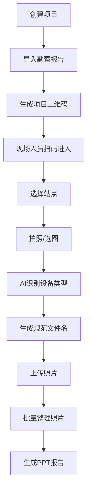

## 1. Product Overview
通信勘察照片智能整理系统是一个面向通信工程勘察场景的全流程照片管理解决方案，解决现场照片拍摄、智能命名、批量整理和报告生成的痛点问题。
- 目标用户：通信勘察工程师、项目经理、现场作业人员
- 产品价值：提升照片整理效率80%以上，实现全流程数据贯通，零安装扫码即用

## 2. Core Features

### 2.1 User Roles
| Role | Registration Method | Core Permissions |
|------|---------------------|------------------|
| 管理员 | 系统注册 | 创建/管理项目、配置规则、生成报告 |
| 现场人员 | 扫码进入 | 拍摄/上传照片、添加备注 |

### 2.2 Feature Module
1. **项目管理页**：项目创建、二维码生成、项目概览
2. **勘察报告导入页**：Word/Excel/PDF智能解析、站点信息管理
3. **站点管理页**：站点列表、批量导入、扩展信息编辑
4. **照片管理页**：按站点分组、批量操作、缩略图预览
5. **规则配置页**：命名规则模板、全局/项目级配置
6. **PPT生成页**：报告参数配置、一键生成PPTX
7. **手机H5上传页**：扫码进入、拍照选图、智能命名、离线上传

### 2.3 Page Details
| Page Name | Module Name | Feature description |
|-----------|-------------|---------------------|
| 项目管理页 | 项目列表 | 展示所有项目，支持搜索、筛选、新建 |
| 项目管理页 | 项目详情 | 查看项目概览、生成二维码、统计信息 |
| 勘察报告导入页 | 文件上传 | 支持Word/Excel/PDF文件上传 |
| 勘察报告导入页 | 智能解析 | 自动解析项目信息和站点列表 |
| 站点管理页 | 站点列表 | 站点展示、编辑、删除、批量操作 |
| 照片管理页 | 照片网格 | 按站点分组展示照片，支持缩略图预览 |
| 照片管理页 | 批量操作 | 批量修改设备类型、备注、删除 |
| 规则配置页 | 命名模板 | 全局和项目级命名规则配置 |
| PPT生成页 | 报告配置 | 选择站点范围、每页照片数、Logo配置 |
| 手机H5上传页 | 扫码登录 | 扫描项目二维码自动加载信息 |
| 手机H5上传页 | 拍照上传 | 调用系统相机/相册，支持多选 |
| 手机H5上传页 | 智能命名 | AI识别设备类型，自动生成规范文件名 |

## 3. Core Process
勘察工程师创建项目→导入勘察报告→生成二维码→现场人员扫码进入→拍照/选图→AI智能命名→上传照片→批量整理→生成PPT报告

## 4. User Interface Design

### 4.1 Design Style
- 主色调：蓝色系（#1890ff）代表专业可靠
- 辅助色：绿色（#52c41a）表示成功，橙色（#faad14）表示警告
- 按钮风格：圆角矩形，轻微阴影，悬停有颜色加深效果
- 字体：系统默认无衬线字体，清晰易读
- 布局风格：卡片式布局，清晰的视觉层级
- 图标：简洁的线性图标，避免过度装饰

### 4.2 Page Design Overview
| Page Name | Module Name | UI Elements |
|-----------|-------------|-------------|
| 项目管理页 | 项目列表 | 卡片式项目展示，包含项目编号、名称、创建时间、二维码预览、统计数据 |
| 照片管理页 | 照片网格 | 响应式网格布局，支持缩略图预览、点击放大、悬停显示操作按钮 |
| 手机H5上传页 | 拍照界面 | 全屏相机预览，大按钮拍照，底部相册选择，顶部站点选择 |
| PPT生成页 | 配置界面 | 表单式配置，实时预览，进度条显示生成状态 |

### 4.3 Responsiveness
- 桌面端优先，采用响应式布局适配平板
- 手机H5端独立开发，针对移动设备优化触摸体验
- 支持横屏和竖屏模式

### 4.4 Interaction Design
- 拖拽排序：站点和照片支持拖拽排序
- 实时预览：照片命名、PPT配置支持实时预览
- 加载动画：文件上传、报告生成时显示加载动画
- 反馈提示：操作成功/失败有明确的Toast提示
